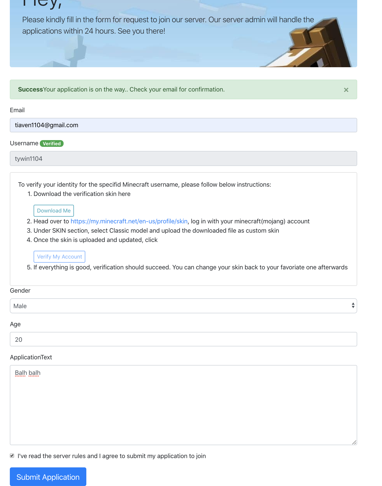
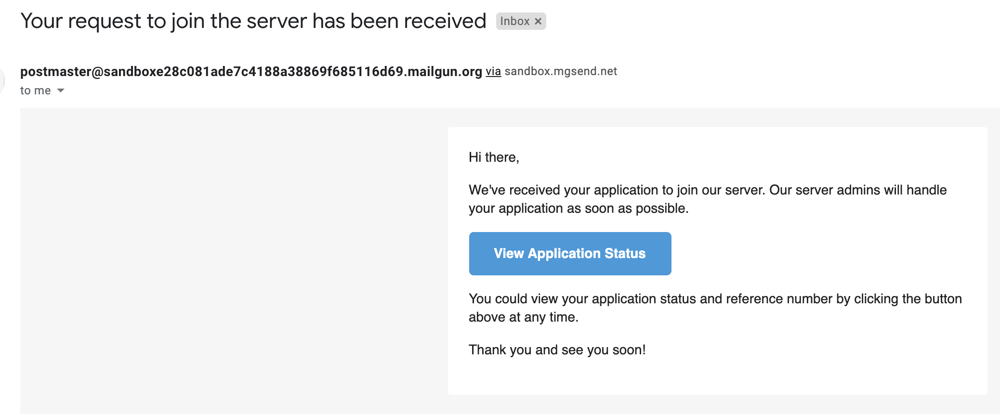
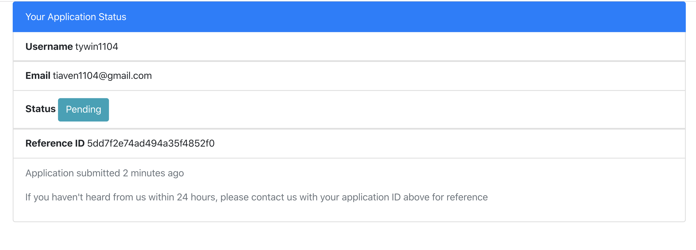
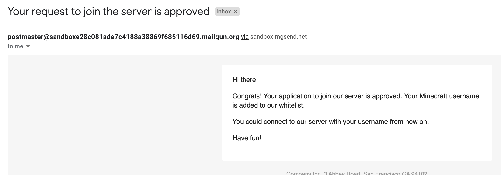
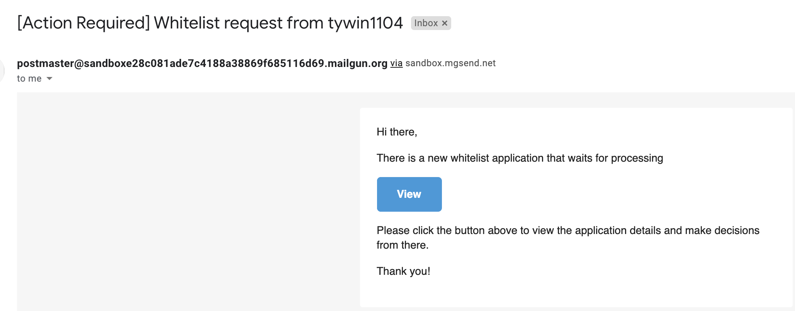
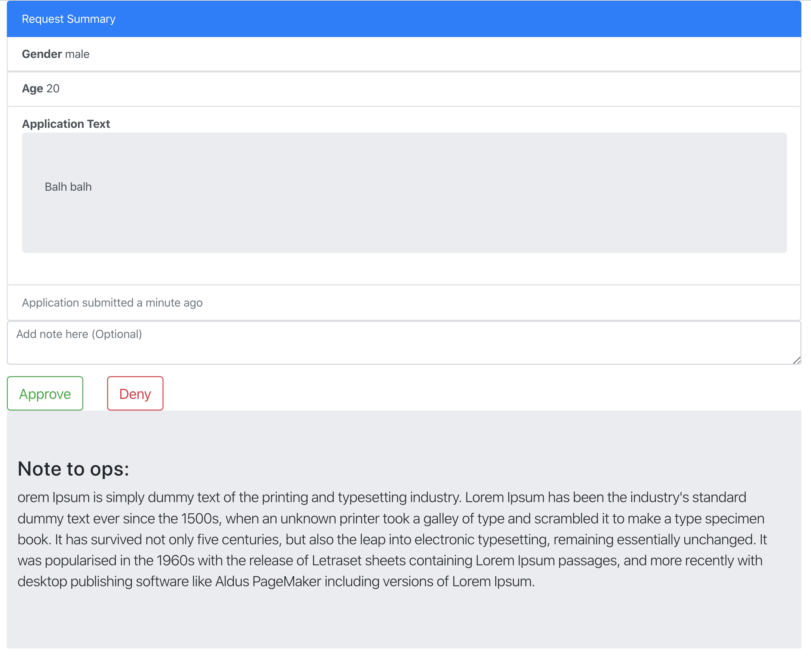
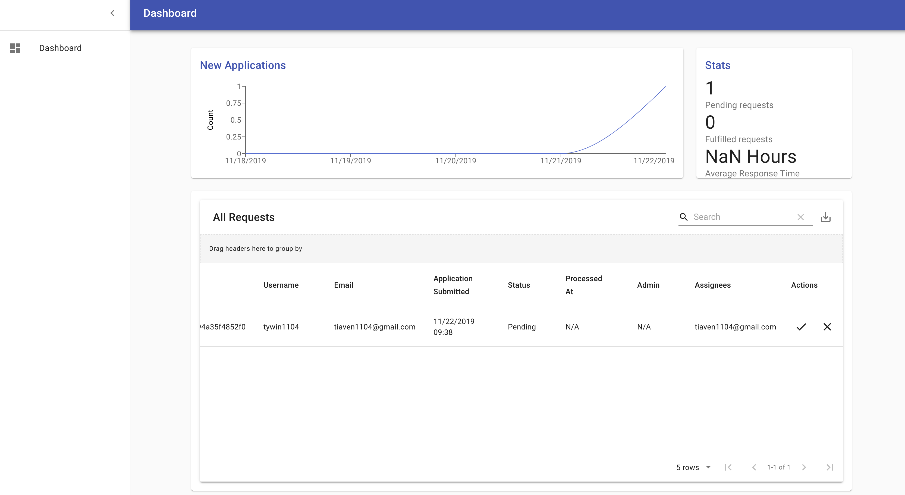

<!--
[![Stargazers][stars-shield]][stars-url]
[![Issues][issues-shield]][issues-url]
[![MIT License][license-shield]][license-url]
 -->

[![LinkedIn][linkedin-shield]][linkedin-url]

<!-- PROJECT LOGO -->
 

  

  <h3 align="center">Minecraft GateKeeper</h3>

  

    An all-in-one reliable whitelist application system for your Minecraft server
     
    ·
    <a href="https://github.com/tywin1104/minecraft-gatekeeper/issues">Request Feature</a>
  

<!-- TABLE OF CONTENTS -->

## Table of Contents

- [Table of Contents](#table-of-contents)
- [Introducation](#introducation)
- [Workflows With Screenshots:](#workflows-with-screenshots)
    - [For Players:](#for-players)
    - [For Ops:](#for-ops)
    - [For Server Owner:](#for-server-owner)
- [Deployment & Configurations](#deployment--configurations)
- [Local Dev Setup](#local-dev-setup)
- [Custimizations](#custimizations)
- [Feature Requests](#feature-requests)
- [License](#license)
- [Contact](#contact)
- [Built With](#built-with)

<!-- ABOUT THE PROJECT -->

## Introducation

Gatekeeper aims to make whitelist application and management for Minecraft server easier than ever before.

What's provided out of the box:

- An easy-to-use self-serve web interface for players to apply for the whitelist
- Email dispatching mechanism for Ops to process incoming requests
- Real-time confirmation and notification emails to users for application status update
- One-click processing workflow for Ops to deny/approve user applications
- Automatic grant whitelist for approved users on the server via RCON
- Management and monitoring dashboard for the server owner
- Rich configuration and customization options (see below)
- Multi-language support with builtin Chinese translation

## Workflows With Screenshots:

#### For Players:

- Players apply for whitelist by filling in required information and complete Minecraft account verification process on the website
  
- Once an application is submitted, the player will receive a confirmation email with a link to view his/her current application status
  
  
- Once the application is approved, the player's Minecraft username will be granted whitelist on the Minecraft server and the player will receive a notification email
  
- If the application is denied, the player will be notified via email as well. The player will be able to re-submit another application

- Key features:
  - Form submission is protected by Google Recaptcha
  - Process in place to verify the player's Minecraft username to prevent identity misuse
  - Disallow repeat/duplicate application from the same user
  - Asynchronous message processing model which improves responsiveness
  - Encoded and encrypted status check the link to prevent access from unintended users

#### For Ops:

- Assigned Ops of each application will be notified via email and will be provided with an action link. On the action page, Ops could view the application details and deny/approve the corresponding application by a single click
  
- Optionally, Ops could add a note for that application when making decisions for future references
  

- Key features:
  - No login required for Ops to simplify the workflow
  - Encryption and encoding in place to prevent misuse: the action page is only visible for Ops who are assigned with a particular application. Once an application is resolved, it will no longer be available.

#### For Server Owner:

- Server owner could view/monitor/manage all applications through the management dashboard which are only accessible with configured root credentials
  

- Key features:
  - Centralized dashboard to manage all applications, view aggregate stats.
  - Able to export application entries to external CSV files
  - The dashboard login page is also protected by Recaptcha to enhance security

## Deployment & Configurations

The web app part(frontend) is intended to be publicly accessible across the Internet and the backend server API should be consumed only by the client application. A running MongoDB and RabbitMQ instance are required components for the system. Setting up the whole stack manually would be cumbersome. I've provided here a deployment strategy based on Kubernetes clusters and Helm chart. See the `mc-whitelist` directory for chart templates. Once you substitute the values for your setup and have a Kubernetes cluster ready, you could run `helm install` to get the whole application running really quick. Minor changes should be made depending on your cloud provider. You could also optionally add certificate for https setup and configure your domain DNS record to the application. The helm chart does not include the MongoDB and Rabbitmq. You are free to choose from any cloud/on-prem solution for them. See `mc-whitelist/charts/backend/values.yaml` and `mc-whitelist/charts/frontend/values.yaml` for configuration details.

## Local Dev Setup

More to come...

[Open API Spec for the backend server](https://app.swaggerhub.com/apis/tywinzhang/mc-whitelist/)

## Custimizations

Here are some possible trivial custimizations that could be done that fits your need. Different from changing the configuration values, these will incur minor code change and require rebuilding the image to your own container registry in order to deploy

- Add/ Change translations for multilanguages

  See `app/locale` directory for translation files

- Add fields to the whitelist request form
- Style custimization for the frontend app page.
- Change Email templates

  See `server/mailer/templates`

- .....
  <!-- LICENSE -->

## Feature Requests

Please open a issue to request a feature or make a contack directly

## License

Distributed under the MIT License. See `LICENSE` for more information

<!-- CONTACT -->

## Contact

Tianyi Zhang - tiaven1104@gmail.com

## Built With

- [React](https://reactjs.org/)
- [Bootstrap](https://getbootstrap.com/)
- [Material UI](https://material-ui.com/)
- [Recaptcha](https://www.google.com/recaptcha/intro/v3.html)
- [Go](https://golang.org/)
- [RabbitMQ](https://www.rabbitmq.com/)
- [MongoDB](https://www.mongodb.com/)

<!-- MARKDOWN LINKS & IMAGES -->
<!-- https://www.markdownguide.org/basic-syntax/#reference-style-links -->
<!--
[stars-shield]: https://img.shields.io/github/stars/othneildrew/Best-README-Template.svg?style=flat-square
[stars-url]: https://github.com/othneildrew/Best-README-Template/stargazers
[issues-shield]: https://img.shields.io/github/issues/othneildrew/Best-README-Template.svg?style=flat-square
[issues-url]: https://github.com/othneildrew/Best-README-Template/issues

[license-shield]: https://img.shields.io/github/license/othneildrew/Best-README-Template.svg?style=flat-square
[license-url]: https://github.com/othneildrew/Best-README-Template/blob/master/LICENSE
-->

[linkedin-shield]: https://img.shields.io/badge/-LinkedIn-black.svg?style=flat-square&logo=linkedin&colorB=555
[linkedin-url]: https://www.linkedin.com/in/tywinzhang/
